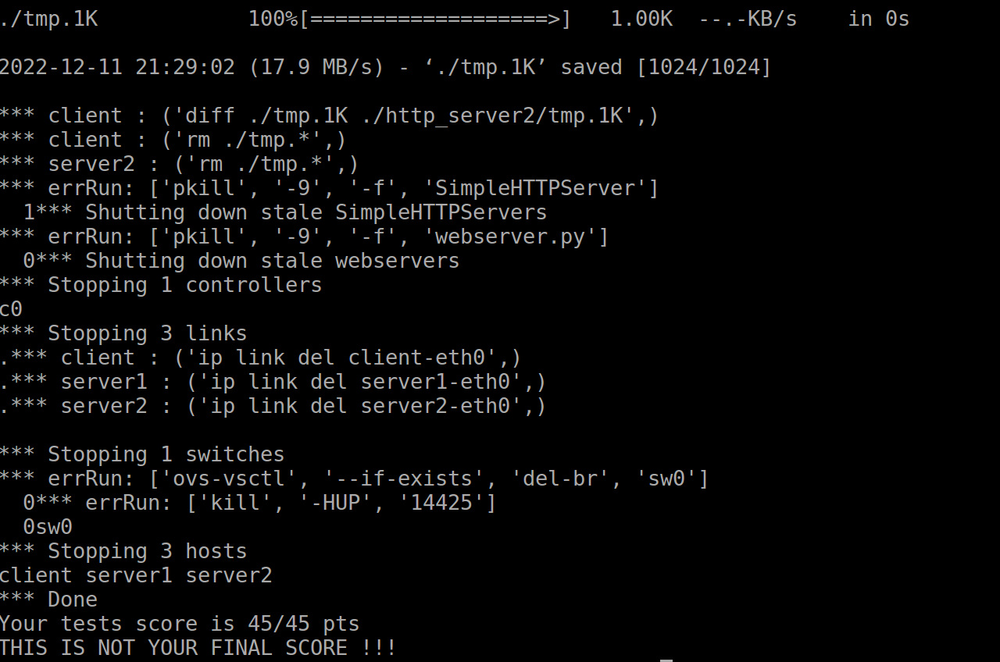

# Computer_Network_Router

Jiangcan 2019011325

## Enviroment

Ubuntu 16.04.7

with command `sudo bash setup.sh`

## Usage

With three terminals, with the behind command

1. `/opt/pox/pox.py --verbose ucla_cs118`
2.
 `chmod +x run.py` 

`sudo ./run.py`

3. 
`make clean` 

`make`

 `.router`

### Test & grading

`sudo mn -c`

`chmod +x autograde.py`

`sudo ./autograde.py`

if everything goes will, you will get as below

## Explain

have finish the following function
1. [] Ping test
2. [] Traceroute tests
3. [] File downloading tests

### Design

The code functions as follows: 

1. When it receives a packet, the router: 
   - Checks if it is an ARP reply, and updates its cache accordingly. 
   - Checks if it is an IP packet destined for the router, in which case it
     either responds to a ping request or returns an ICMP Not Reachable packet.
   - Checks if it is an IP packet destined for another IP, in which case it
     looks up the packet and forwards it to the appropriate interface. If the
     destination MAC address is unknown, it sends out an ARP request, then
     flushes the outbound packet queue when interpreting the response. 
2. While undertaking other actions, the router keeps track of IP->MAC address
   associations for each interface in a cache table. When a cache entry becomes
   stale, it is removed from the queue. 

---

`simple-router`: This module receives packets at an interface and processes them.  When a packet is received the ethernet header is inspected to determine if it is an IP packet or an ARP packet.  If it is an ARP packet the arp handler function is used to determine if the ARP packet is an ARP reply or reuqest.  If it is an ARP request, the router formulates an ARP reply for the desired interface if it exists and sends the packet back to the requester.  If the packet is an ARP reply the router adds the given MAC-IP mapping to the arp cache and then sends out any packets who were waiting for this specific mapping.  

`Handle Packet` : Routine that receive the packet and inspect it. The handlePacket routine will ignore any packet that is not a broadcast, or not destined to the router. Also any packet that is not IPv4 or Arp will be ignored. 

`IP handler routine`: After inspecting and determining that the type of the packet is an IP packet, the IP handler routine will be called to handle the packet. The handleIp routine extract the IP header from the packet and verify its checksum. If the checksum is valid, the routine proceed by handling the packet if not it will just ignore it. The routine will then proceed by decrementing the TTL, recalculating the checksum and inspecting the packet. If Its TTL is less than 0 or the packet is destined to the router, the routine will check if the packet carries an ICMP payload and dispache it properly. If the routine found that the packet needs to be forwarded, it will call the lookup routine to find the next-hop IP address in the routing table and attempt to forward it there. If not the request will be queued to be send later. 

`ICMP reply and messages` : Routines that build an ICM messages based on the type of ICMP: Echo Reply message (type 0), Time Exceeded message (type 11, code 0), and Port Unreachable message (type 3, code 3). 

`arp-cache`: Go through each ARP request and check if it is valid. A request is valid if it hasn't been sent more than 5 time. If valid, then create ARP request packet with an updated time and hop count. In order to create packets, needed to construct ethernet and ARP headers. Finally, check each entry in the ARP cache and if its 'isValid' field is true. If not, get rid of it from the cache.

`routing-table`: Our team implemented the lookup portion of the routing table.  Lookup finds the next hop IP address by comparing the network ID portion of entries in the routing table with the network portion of the given target IP.  The network ID portion of the IP address is computed using the mask associated with the entry. 

## Problems encountered

This project involved a lot of bugs and associated bug fixing. This project
intermittently fails with given certain factors, such as:

1. The timings of the `./router` and `./run.py` commands. 
2. Mininet's 'freshness'; ie. if it has been run before in the container. 
3. Mininet's mood. 
4. Wrong APR cache

One problem encountered was converting between host byte order and network byte order.  adding to the confusion, some things worked when no conversion was used while other things had to be converted manually between byte orders.  One example is in the ARP header where the hardware and protocol type had to be converted between byte orders while the hardware and protocol address length fields did not.  The best solution discovered for this was to look in the provided print functions in the core/utils file.  The implementation of these functions would show you what had to be converted and what did not.  

And I encountered a question is getting segfault (and program crash) when implementing the ICMP messages handler. This was caused by wrong calculation of the icmp header and the icmp payload. I had to figure out the correct size of the icmp header and the icmp payload to make it work. I also had difficulties figuring out which icmp messages we should deliver and when we should deliver them. I had mixed up all the icmp types and the icmp codes which made things more difficult for me to make the program work. I also faced an issue of Resetting Interface list empty with Mininet when I tried to transfer the large file. After Brian confirmed to me that the transfer of the large file works properly, I figured out that I am doing somethig wrong in my side when I run Mininet on vagrant. So, I destroyed my VM and start from vagrant up again in a Windows command terminal and using Putty to run the router which eventually made the large file transfering works properly and the diff command returned nothing.

Also in this project, I found GDB was not particularly useful due to an unexpected permissions error, so most
of debugging was done through the `printf` or the log method.

---

## Known Limitations

When POX controller is restarted, the simpler router needs to be manually
stopped and started again. In addition, the code may fail when responding to
certain oddly formed IP packets (although this is not expected to occur during
the program's operation). 

## Acknowledgement

This implementation is based on the original code for Stanford CS144 lab3

And thanks to https://github.com/awkshaya/SimpleRouter